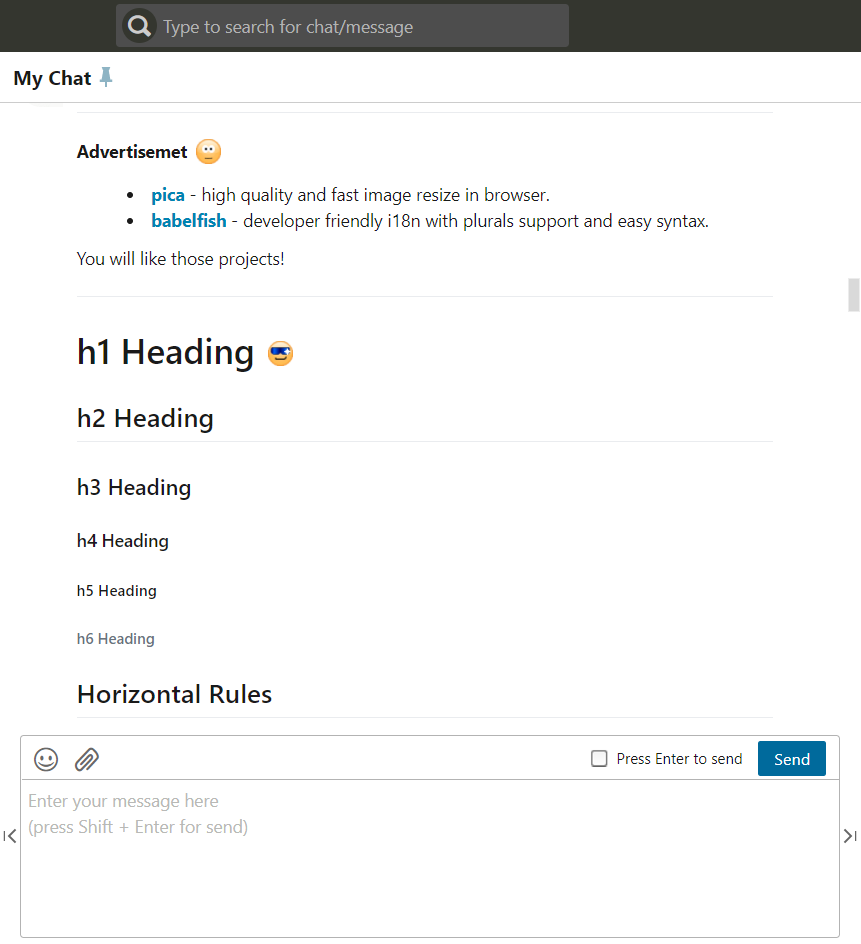
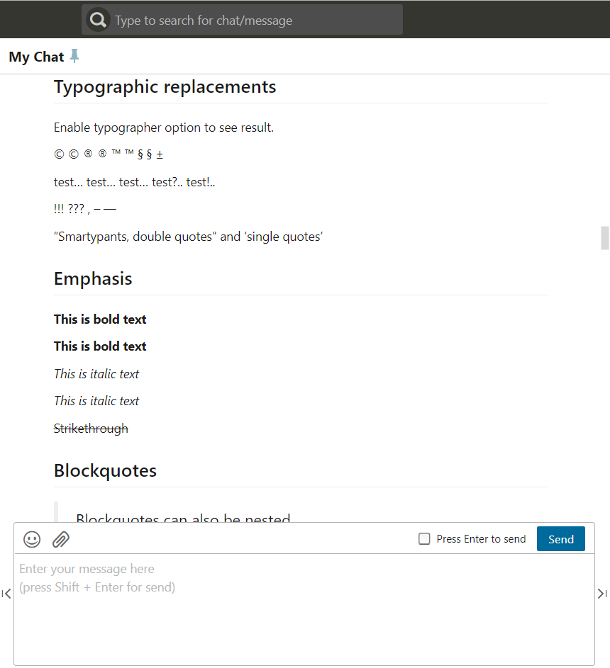
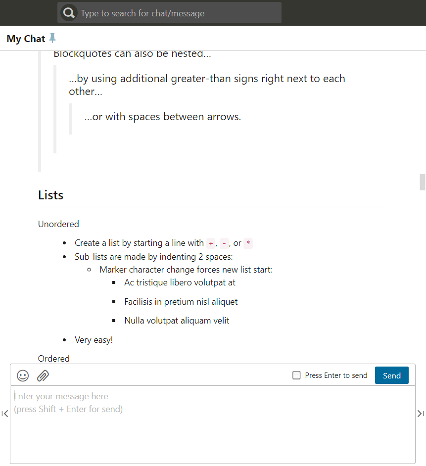
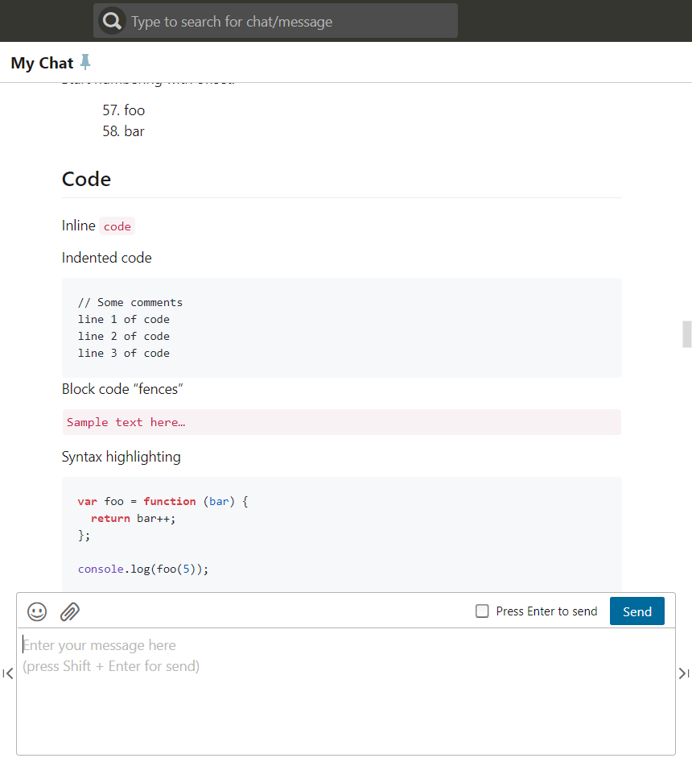
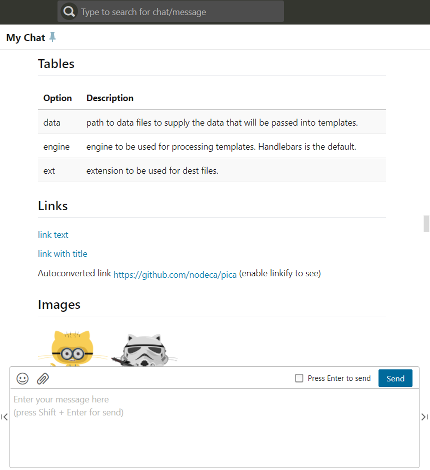
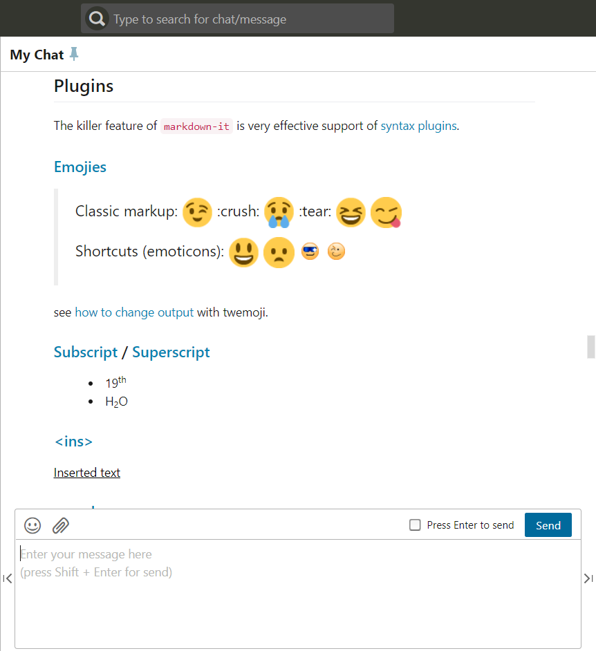

## Chrome extension render chatwork HTML to markdown
Using [Markdown-it](https://markdown-it.github.io/markdown-it) for render [chatwork](https://www.chatwork.com) HTML.

### Screenshot

## License
[MIT License](http://en.wikipedia.org/wiki/MIT_License)